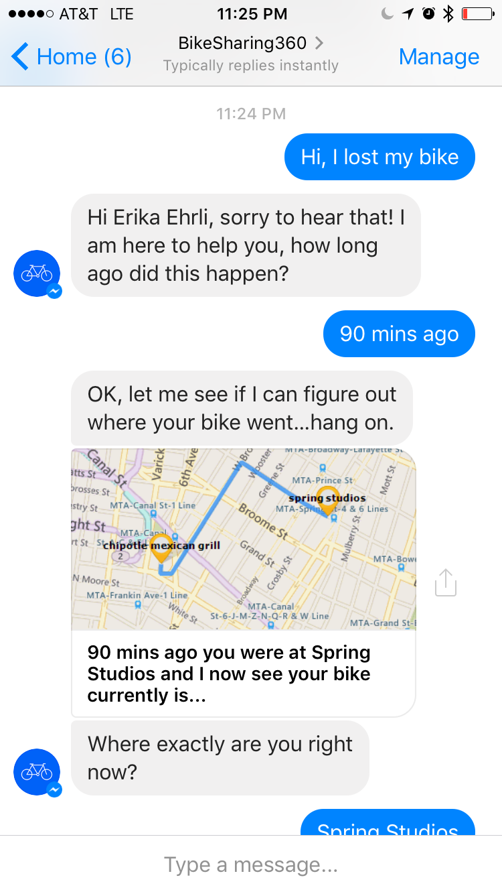
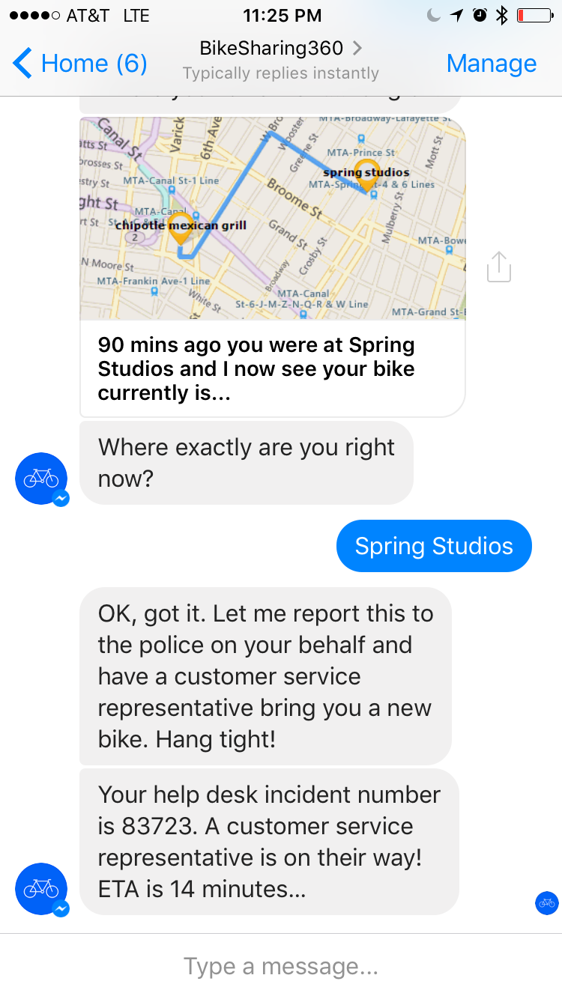
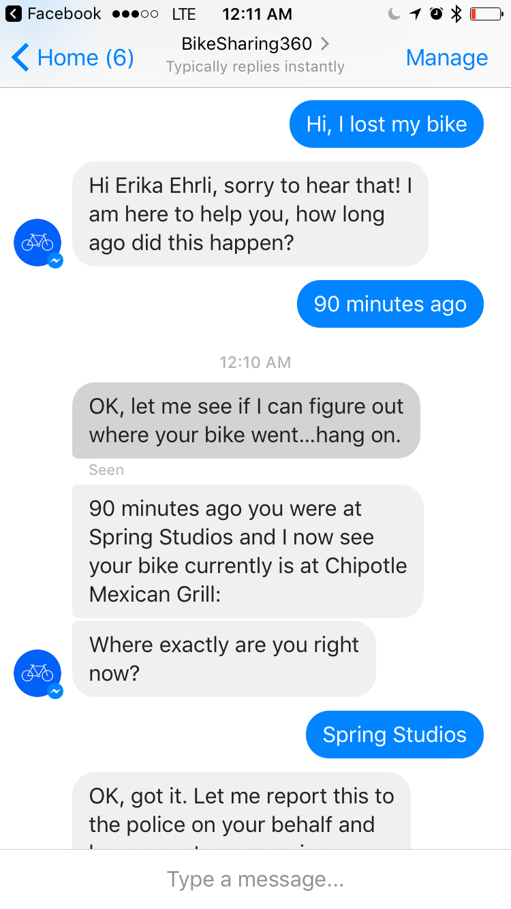
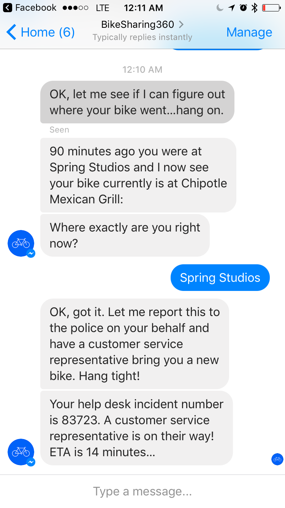

# BikeSharing360_BotApps
BikeSharing360Bot shows how you can help your business grow and scale its customer service abilities through an intelligent bot that can understand customers and know when it might need to involve humans to help more complex issues. 
This application integrates Language Understanding Intelligent Service (LUIS) to help understand customer intents which then launched into appropriate business flows and promptes users with appropriate and succinct questions to gather details.

## Screens

## Requirements
You need an Azure subscription to deploy the bot service. [Try it for free](https://azure.microsoft.com/en-us/) 

## Setup the bot service
* 1. Deploy CustomerServiceApis into Azure (You need a bing map service subscription to make "GetMapWithRoute" api work).
* 2. Create a new Azure language understanding bot service. ([How](https://docs.botframework.com/en-us/azure-bots/build/first-bot/#navtitle))
* 3. Setup continuous integration. ([How](https://docs.botframework.com/en-us/azure-bot-service/manage/setting-up-continuous-integration/#navtitle))
* 4. Submit the BikeSharing360Bot code into repository.
* 5. Sign into https://www.luis.ai and find the application created in step 2.
* 6. Click "New App"->"Import Existing Application" and choose luis\BikeSharing360Luis.json. BikeSharing360Luis will be created.
* 7. Enter the "BikeSharing360Luis" app. Click "train" button on the left bottom. Then click "publish" on the left. Save the app-id and subscription-key information from the URL.
* 8. Go back to the code. Open BikeSharing360LuisDialog.csx. Replace "_YourModelId_", "_YourSubscriptionKey_" with the keys you got in step 7.
* 9. Submit the code.
* 10 Now, you can publish the bot ([How](https://docs.botframework.com/en-us/azure-bot-service/manage/publish/#navtitle)) and test it. 

## How to sign up for Microsoft Azure

You need an Azure account to work with this demo code. You can:

- Open an Azure account for free [Azure subscription](https://azure.com). You get credits that can be used to try out paid Azure services. Even after the credits are used up, you can keep the account and use free Azure services and features, such as the Web Apps feature in Azure App Service.
- [Activate Visual Studio subscriber benefits](https://www.visualstudio.com/products/visual-studio-dev-essentials-vs). Your Visual Studio subscription gives you credits every month that you can use for paid Azure services.
- Not a Visual Studio subscriber? Get a $25 monthly Azure credit by joining [Visual Studio Dev Essentials](https://www.visualstudio.com/products/visual-studio-dev-essentials-vs).

## Blogs posts

Here's links to blog posts related to this project:

- Xamarin Blog: [Microsoft Connect(); 2016 Recap](https://blog.xamarin.com/microsoft-connect-2016-recap/)
- The Visual Studio Blog: [Announcing the new Visual Studio for Mac](https://blogs.msdn.microsoft.com/visualstudio/2016/11/16/visual-studio-for-mac/)
- The Visual Studio Blog: [Introducing Visual Studio Mobile Center (Preview)](https://blogs.msdn.microsoft.com/visualstudio/2016/11/16/visual-studio-mobile-center/)
- The Visual Studio Blog: [Visual Studio 2017 Release Candidate](https://blogs.msdn.microsoft.com/visualstudio/2016/11/16/visual-studio-2017-rc/)

## Copyright and license
* Code and documentation copyright 2016 Microsoft Corp. Code released under the [MIT license](https://github.com/Microsoft/BikeSharing360_BotApps/blob/master/license.txt).

## Code of Conduct 
This project has adopted the [Microsoft Open Source Code of Conduct](https://opensource.microsoft.com/codeofconduct/). For more information see the [Code of Conduct FAQ](https://opensource.microsoft.com/codeofconduct/faq/) or contact [opencode@microsoft.com](mailto:opencode@microsoft.com) with any additional questions or comments.
